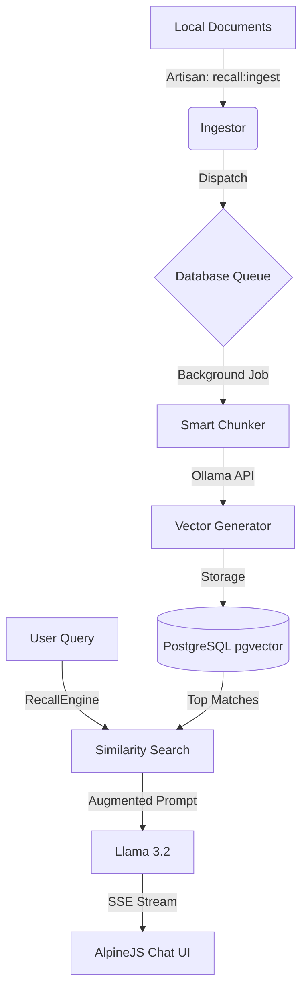

# Lara-Ollama-RAG 🧠🐘

> **A high-performance, private, and scalable RAG (Retrieval-Augmented Generation) system built for Laravel 11.**


---

## 📖 Overview

**Lara-Ollama-RAG** is a production-ready implementation of Retrieval-Augmented Generation. It allows developers to chat with private data without using cloud APIs or paying for tokens. 

By combining **Laravel 11**, **pgvector**, and **Ollama**, this project offers a secure, 100% local knowledge engine that stays entirely on your infrastructure.

---

## 🛠️ System Architecture

The system is architected to handle heavy AI tasks in the background using Database Queues, ensuring the web interface remains fast.




## ✨ Key Features

- 🚀 **SSE Streaming**  
  Character-by-character response delivery for a modern AI feel.

- 📦 **Asynchronous Ingestion**  
  AI embeddings are processed in the background via **Database Queues**.

- 🔍 **Vector Similarity Search**  
  Uses **Cosine Distance** for semantic document retrieval.

- 📝 **Smart Chunking**  
  Preserves context by splitting documents at natural paragraph breaks.

- 🔒 **Privacy First**  
  No data ever leaves your **local environment**.


## 🚀 Installation & Setup

### 1️⃣ Database Infrastructure (Docker)

Start the **pgvector-enabled PostgreSQL container**:

```bash
docker run --name lara-recall-db -e POSTGRES_PASSWORD=root -p 5433:5432 -d pgvector/pgvector:pg17
```

---

### 2️⃣ Local AI Setup (Ollama)

Ensure **Ollama** is installed and running, then pull the required models:

```bash
ollama pull llama3.2:3b-instruct-q5_K_M
ollama pull nomic-embed-text
```

---

### 3️⃣ Application Configuration

Update your `.env` file with the following settings:

```env
DB_CONNECTION=pgsql
DB_HOST=127.0.0.1
DB_PORT=5433
DB_DATABASE=postgres
DB_USERNAME=postgres
DB_PASSWORD=root

# Scalable Background Processing
QUEUE_CONNECTION=database

# Ollama Models
OLLAMA_MODEL_CHAT=llama3.2:3b-instruct-q5_K_M
OLLAMA_MODEL_EMBED=nomic-embed-text
```

---

### 4️⃣ Build the System

Run the following commands inside your project directory:

```bash
composer install
php artisan migrate
php artisan serve
```

---

## 📂 Project Structure

| Path | Responsibility |
|-----|----------------|
| `app/Services` | AI service layer for embeddings and chat interaction |
| `app/Jobs` | Background jobs for document ingestion and embedding generation |
| `app/Http/Controllers` | Handles API requests and responses |
| `database/migrations` | Database schema including pgvector setup |
| `routes/web.php` | Application routes |
| `resources/views` | Frontend interface for the AI chat |


## 📝 Document Ingestion

To feed your AI knowledge base, place your documents in a folder and run:

```bash
php artisan recall:ingest path/to/your/knowledge
```

Start the queue worker in a separate terminal to process the vectors:

```bash
php artisan queue:work
```
---

Built with **Laravel 11** & **Ollama**. 🐘🤖
